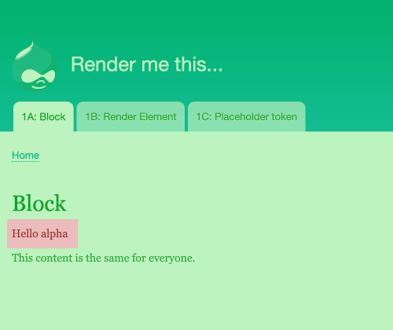
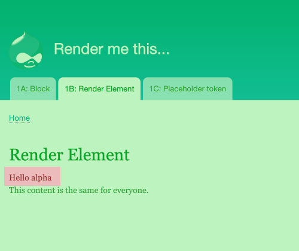
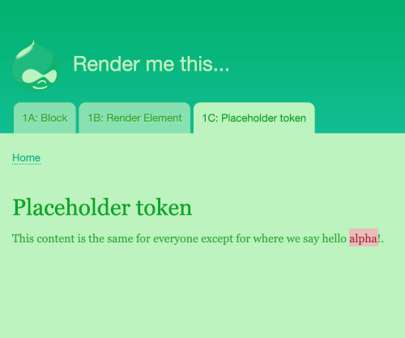
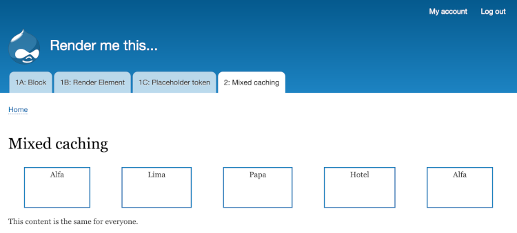
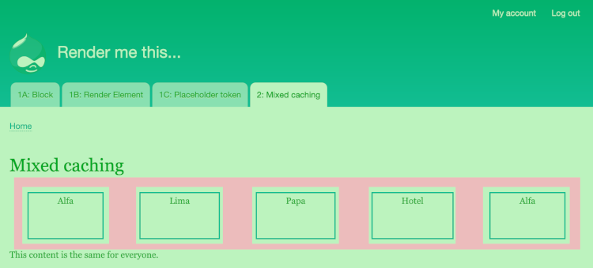
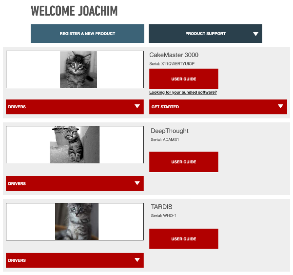
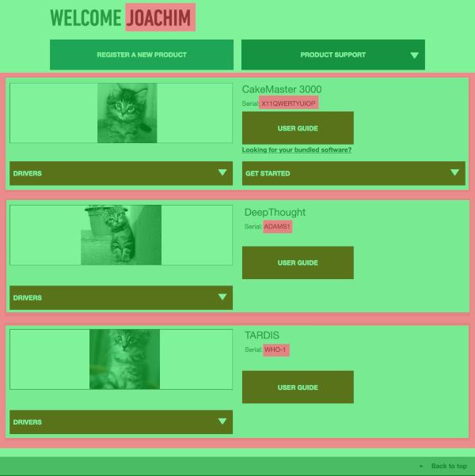

class: center, middle

# Render me this... lazily

DrupalCon Europe 2020

---

# About me

TODO - pic!

- Joachim Noreiko
- http://www.noreiko.com/
- https://www.drupal.org/u/joachim
- https://twitter.com/joachimnicolas

Doing Drupal since 2007!

---

# Basic concepts

- Cache contexts
- Cache tags

---

## Cache contexts

Cache contexts define how a piece of cacheable data can vary.

Examples:

- 'user': This data is different for every user.
- 'user.roles': This data is different for each role.
- 'route': This data is different on every route.

The cache API uses the cache contexts of a piece of data in the cache to determine if it's actually relevant to the current situation:

1. User Apha loads the page, which has the 'user:roles' context.
2. There is cached data for the page, but it's not for user Alpha's role: cache miss.

---

## Cache tags

Cache tags define the data that cached data depends on. When the dependency changes, the cached data is invalidated.

Examples:

- 'node:5': Invalidate when node 5 is edited or deleted.
- 'node_list': Invalidate when any node is edited or deleted, or a new node is created.

You can invalidate tags manually:

```php
\Drupal::service('cache_tags.invalidator')->invalidateTags($tags);
```

You can define your own cache tags.

---

## Lazy builders

Lazy builders allow switching of cache contexts within a page.

---

## Default cache contexts

Every cached render array receives some cache contexts by default. These are defined as a parameter to the service container:

```yaml
  renderer.config:
    # @default ['languages:language_interface', 'theme', 'user.permissions']
    required_cache_contexts: ['languages:language_interface', 'theme', 'user.permissions']
```

This setting can be overridden: see `default.services.yml`.

---

## What counts as 'uncacheable'?

The Dynamic Page Cache considers the 'user' and 'session' cache contexts as uncacheable. In other words, a page that varies per-user or per-session won't be cached. This is defined as a parameter to the service container:

```yml
  renderer.config:
    auto_placeholder_conditions:
      contexts: ['session', 'user']
```

This setting can be overridden: see `default.services.yml`.

---

# Example 1: Showing the username on a page

Suppose we want to show the user's name on a page:

```
Hello $username
```

We want the page overall to be cacheable, so we need to use lazy rendering for the part that is user-specific.

We're going to look at three different ways to do this.

---

# Example 1A: Using a block with automatic lazy builders

Drupal automatically handles blocks with lazy builders. This means that a block with poor cacheability won't affect the rest of the page it's on.

---

# The block plugin

A first attempt at a block plugin:

```php
/**
 * Provides a block to greet the user.
 *
 * @Block(
 *   id = "drupalcon_2020_lazy_rendering_username_block",
 *   admin_label = @Translation("DrupalCon 2020 Username"),
 * )
 */
class UsernameBlock extends BlockBase {

  public function build() {
    return [
      '#markup' => $this->t('Hello @username', [
        '@username' => \Drupal::currentUser()->getDisplayName(),
      ]),
    ];
  }

}
```

---

# What's wrong with this?

This output is unique to each user:

```php
      '#markup' => $this->t('Hello @username', [
        '@username' => \Drupal::currentUser()->getDisplayName(),
      ]),
```


By default, Drupal's dynamic page cache caches pages per-role. So the following can happen:

1. User Alpha visits the site and is shown the page containing the block. The
whole page is cached.
2. User Beta visits the same page. They are served the cached page... which contains user *Alpha*'s name.

---

# The fix: cache contexts

The cache contexts of a render array tell the caching system how that piece of content varies.

In our case, each user should see something different, so the cache varies per-user.

The cache context here should therefore be 'user'.

```php
class UsernameBlock extends BlockBase {

  // ... SNIP

  public function getCacheContexts() {
    return ['user'];
  }

}
```

---

# Also: cache tags

Cache tags define how an item in the cache is invalidated. Here we know that this cached block should be invalidated if the user's username is ever changed.

Drupal defines a cache tag for every entity, to allow cached data to be invalidated when that entity is edited.

```php
  public function getCacheTags() {
    return ['user:' . \Drupal::currentUser()->id()];
  }
```

---

# How this works in the cache

In the dynamic_page_cache (the `cache_dynamic_page_cache` database table), there is an entry for the page, with this in the render markup where the block should be:

```html
<drupal-render-placeholder
  callback="Drupal\block\BlockViewBuilder::lazyBuilder"
  arguments="0=drupalcon2020username&amp;1=full&amp;2"
  token="X9baLbyxEnCHc8dEmbBhfT-P-sC-PKWDrLoL5eZiImg">
</drupal-render-placeholder>
```

The markup stored in the cache contains a special pseudo-HTML tag which defines:

- the lazy builder callback is provided by the block entity view builder: `Drupal\block\BlockViewBuilder::lazyBuilder()`
- its parameters: in this case the block name and view mode

---

# The result



- green: cached in the dynamic page cache
- red: block rendered by the lazy builder

---

# Example 1B: render element with lazy builder

If a block doesn't provide enough control in the page layout, we can use a lazy builder for a single render element.

---

# Sample code

In our page controller `LazyBuilderRenderElementController`:

```php
  public function content() {
    // Use a container to wrap the elemet in a DIV.
    $build['intro'] = [
      '#type' => 'container',
    ];

    // Dynamic content.
    $build['intro']['content'] = [
      '#lazy_builder' => [get_class($this) . '::lazyBuilder', []],
    ];
    $build['intro']['content']['#cache']['contexts'] = ['user'];

    // Normal content.
    $build['static'] = [
      '#markup' => $this->t("This content is the same for everyone."),
    ];
    return $build;
  }

  public static function lazyBuilder() {
    $build = [
      '#markup' => t('Hello @username', [
        '@username' => \Drupal::currentUser()->getDisplayName(),
      ]),
    ];
    return $build;
  }
```

A gotcha: the parameters for the lazy builder callback will be cached with the lazy builder definition as part of the outer render array. So for example, we can't pass the user ID as a parameter, because then the same user ID would be used each time.

---

# How it looks in the cache

In `cache_dynamic_page_cache`:

```html
<div class="content">
<div>
  <drupal-render-placeholder
    callback="Drupal\drupalcon_2020_lazy_rendering\Controller\
      LazyBuilderRenderElementController::lazyBuilder"
    arguments=""
    token="VIrnyeL08lsH5XQo1sNE3tIwI6dqru2NZ01he2x1z6k">
  </drupal-render-placeholder></div>
This content is the same for everyone.
</div>
</div>
```

Here we have our own lazy builder callback, and the placeholder is within the content we output in the controller.

---

# The result



- green: cached in the dynamic page cache
- red: single render element rendered by the lazy builder

---

# Extra: caching the lazy builder output

We can have the output of the lazy builder also be cached (in `cache_render`) by specifying a cache key:

```php
    $build['intro']['content'] = [
      '#lazy_builder' => [get_class($this) . '::lazyBuilder', []],
      '
    ];
    $build['intro']['content']['#cache']['contexts'] = ['user'];
    $build['intro']['content']['#cache']['keys'] = ['some-cache-key'];
```

---

# Example 1C: placeholder tokens

For even finer control, we can handle the render system's placeholder token ourselves and insert single piece of text dynamically into the cached page.

---

# Sample code

In our page controller `LazyBuilderPlaceholderTokenController`, we explicitly create the placeholder token, and then define the lazy builder callback that will handle it.

We create a hash for the token to guard against accidental replacement of something else, but the token can be any string.

```php
  public function content() {
    $build['intro'] = [
      '#type' => 'container',
    ];

    $placeholder = Crypt::hashBase64('username');
    $build['static'] = [
      '#markup' => $this->t("This content is the same for everyone " .
        "except for where we say hello $placeholder!"),
    ];
    $build['#attached']['placeholders'][$placeholder] = [
      '#lazy_builder' => [get_class($this) . '::lazyBuilder', []],
    ];

    return $build;
  }

  public static function lazyBuilder() {
    $build = [
      '#markup' => \Drupal::currentUser()->getDisplayName(),
    ];

    return $build;
  }
```


---

# How it looks in the cache

In `cache_dynamic_page_cache`:

```html
<div>
This content is the same for everyone except for where
we say hello jgKbjDDhQJ-3GRM9OrsKxUMHWOpxXXDS3bXzi2gqT64!
</div>
```

Here we just inserted the placeholder right into the markup, but it could instead be passed as a theme variable and inserted anywhere in a Twig template.

---

# The result



- green: cached in the dynamic page cache
- red: placeholder replaced with the result of the lazy builder

---

# Example 2: using letterblocks to spell the current user's name

We're going to show the username as a row of squares, one for each letter.

The current user's name is uncacheable, but each render element that shows a single letter, A-Z, can be cached, since each letter is the same for everyone.



---

# Caching strategy

- Overall page: cached per-role
    - Username render element: not cached
        - Letter render elements: cached

---

# Sample code
## Route callback

As with example 1B, we use a lazy builder for a render element.

```php
  public function content() {
    $build = [];

    $build['username'] = [
      '#lazy_builder' => [get_class($this) . '::nameLazyBuilder', []],
    ];
    $build['username']['#cache']['contexts'] = ['user'];

    $build['static'] = [
      '#markup' => $this->t("This content is the same for everyone."),
    ];
  }
```

---

## Username element


```php
  public static function nameLazyBuilder() {
    $build['name'] = [
      '#type' => 'container',
    ];

    $username = \Drupal::currentUser()->getDisplayName();
    foreach (str_split($username) as $character) {
      $build['name'][] = static::buildLetter($character);
    }

    return $build;
  }
```

---

## Letter element

This element gets cached because we give it a cache key. The key depends on the particular letter, so there will be a cache item for each different letter.

```php
  public static function buildLetter($character) {
    $build['letter'] = [
      '#type' => 'container',
    ];

    $build['letter']['content'] = [
      '#markup' => '', // ... letter element content here.
    ];
    $build['letter']['#cache']['keys'] = ['letter-' . $character];

    return $build;
  }
```

---

# How this works in the cache

In `cache_dynamic_page_cache`:

```html
<div class="content">
<div>
  <drupal-render-placeholder
    callback="Drupal\drupalcon_2020_lazy_rendering\Controller\
      MixedCachingController::nameLazyBuilder"
    arguments=""
    token="yhw9knZLVLza6HtBXeuFKEGVIq0v63c2H2QyYS0izO4">
  </drupal-render-placeholder>
  This content is the same for everyone.
</div>
</div>
```

In `cache_render`, each letter gets a row with a cache ID `letter-a:[CONTEXTS]`:

```html
<div class="letter-block">
  <span>Alfa</span>
</div>
```

Double check!

- Clear your cache; reload; check what got cached.
- Paranoid: hack a single letter in the cached markup and see that it changes when you reload the page!

---

# The result



- outer green: cached in the dynamic page cache
- red: render element rendered by the lazy builder; depends on the current user
- inner green: each letter block is cached individually

---

# Example 3: the real world

Show the user a list of the products they own on their account page.

- Each user has different products, so that's not cacheable.
- But each product itself looks identical, so each single product is a cacheable piece of content.
- But within each product, we want to show the serial number of the actual item the user owns. So that part's not cacheable.

---

# How it looks



---

# Caching strategy



---

# How it works

- overall page: cached with default contexts
    - username: inserted with token placeholder lazy builder
- product list: lazy builder, uncached
    - each product item: cached with default contexts
        - serial number: inserted with token placeholder lazy builder

---

# Conclusion

- Think about how cacheability varies across your page
- Define the cache contexts
- Slice up your render structure using lazy builders

---

# Resources

- This presentation and the custom module with all the code: TODO GITHUB
- Cache API: https://www.drupal.org/docs/drupal-apis/cache-api
- Lazy builders: https://www.drupal.org/docs/8/api/render-api/auto-placeholdering
- Lazy Builders in Drupal 8 - Caching FTW: https://www.qed42.com/blog/lazy-builders-drupal-8-caching-ftw
- Using lazy builders with Twig templates: http://www.noreiko.com/blog/using-lazy-builders-twig-templates

Thanks for watching! Any questions?

